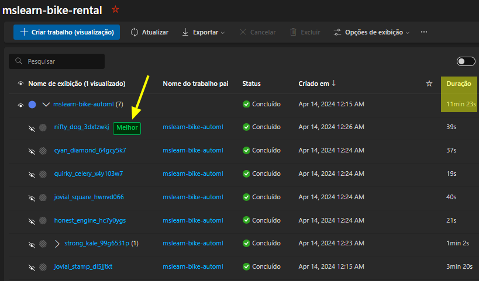
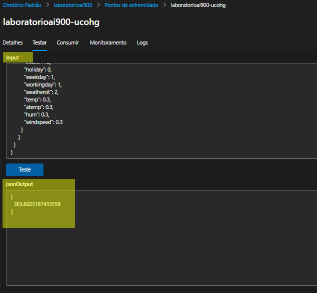

# Azure Machine Learning Lab

Com o Lab de Machine Learning proposto na DIO, segue visão sobre como foi possível cumprir o desafio:

Durante o módulo, foram referenciadas estas documentações externas:

[Explore Automated Machine Learning in Azure Machine Learning](https://aka.ms/ai900-auto-ml)

[Explore Azure AI Services](https://aka.ms/ai900-azure-ai-services)

E como base de informações: 
[Dados em formato csv](https://aka.ms/bike-rentals)

----

## Criar um cadastro(caso ainda não tenha) ou autenticar-se na plataforma da Azure:

No meu caso, como ainda não possuia cadastro, bastou acessar [Link da plataforma](https://azure.microsoft.com/pt-br/) e realizar cadastro. Ao clicar em `Testar o Azure gratuitamente` basta realizar um cadastro onde é possível realizar laboratórios sem necessidade de realizar pagamentos enquanto em fase de aprendizado.

## Seguir passos da documentação

Parece óbvio mas após executar o Lab apenas com instruções do módulo onde ficam questões em aberto e reler e seguir os passos da [documentação](https://aka.ms/ai900-auto-ml),  pude sanar pontos que não estavam claros até então.

Em resumo, os passos foram:

- Criar um workspace no Azure Machine Learning;
- Usar machine learning automated para treinar um modelo;
- Analisar melhor modelo gerado;
- Aplicar e testar o melhor modelo;
- Testar o serviço gerado;
- Encerrar serviços criados.
----

## Pontos de atenção:

1. **O treinamento "demora" para ser aplicado**: Reparei que a Tarefa(Job) `mslearn-bike-rental` relacionou 7 modelos diferentes, levando em torno de 11 minutos até se apresentar como concluída(conforme imagem abaixo)

2. Falha ao tentar criar/aplicar modelo:

Após alguns minutos da criação do `predict-rentals` conforme documentação, listou como `Estado da operação : Failed`

Ao buscar por soluções, localizei outro aluno do mesmo Bootcamp, que apresentou [esta solução](https://github.com/casjunior93/Projeto-DIO---Trabalhando-com-Machine-Learning-na-Pratica-no-Azure-ML/blob/main/README.md#passo-3---criando-o-modelo) qual consegui seguir os passos com sucesso.

3. Como teste proposto, utilizei o seguinte json:

<code>
{
  "input_data": {
    "data": [
       {
         "day": 1,
         "mnth": 1,   
         "year": 2022,
         "season": 2,
         "holiday": 0,
         "weekday": 1,
         "workingday": 1,
         "weathersit": 2, 
         "temp": 0.3, 
         "atemp": 0.3,
         "hum": 0.3,
         "windspeed": 0.3 
       }
     ]
  }
}
</code>

E como resultado, a previsão gerada foi de 363.6025187433559 , conforme imagem.

